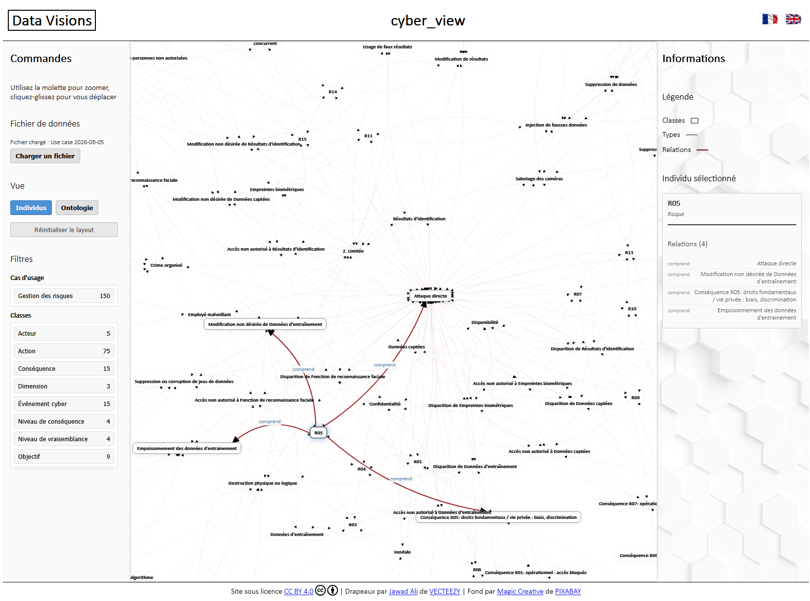

# cyber_view

## Objective

The objective of cyber_view is to **enable the visualization of data used in the cyber scope**.

The general idea would be to simulate a structured data lake, which will expand progressively, with new data from different cyber use cases, and to offer different visualizations of this data.




This should also allow to:
- **demonstrate the value of data visualization**, for example to carry out risk studies (e.g., realizing that objects have already been created and reusing them, identifying inconsistencies and managing them, acting on the various components of risks and not only on vulnerabilities, etc.);
- **highlight the [cyber_ontology](https://github.com/matthieu-grall/cyber_ontology) and the [methodological tools for artificial intelligence (AI)](https://github.com/matthieu-grall/ai)**;
- **carry out numerous study or research projects**.

---

[![CC BY 4.0][cc-by-shield]][cc-by]

This project is licensed under a 
[Creative Commons Attribution 4.0 International License][cc-by].

[![CC BY 4.0][cc-by-image]][cc-by]

[cc-by]: http://creativecommons.org/licenses/by/4.0/
[cc-by-image]: https://i.creativecommons.org/l/by/4.0/88x31.png
[cc-by-shield]: https://img.shields.io/badge/License-CC%20BY%204.0-lightgrey.svg

---

## Features

- **Interactive force-directed graph** — nodes represent cyber objects, edges represent their relationships; automatic layout powered by D3.js
- **Two views** — *Individuals* (ontology-native use case data) and *Ontology* (cyber_ontology class hierarchy)
- **Node interaction** — hover for a tooltip, click for a details panel, drag to reposition
- **Filtering** — separate multi-select filters by use case and by class, with consistent UI in both views
- **Multilingual** — French and English, switchable at any time, persisted in the browser
- **Load your own data** — import any use case JSON file directly in the browser
- **No installation required** — pure static web application

---

## Architecture status

The project now prepares a **three-layer architecture** to support future visualizations without changing current behavior:

- **Visualizations layer** — rendering engines (currently a shared Network engine)
- **Views layer** — business-oriented views (currently Individuals and Ontology)
- **Data layer** — independent data loading and graph-data preparation

In the current version, **Individuals** and **Ontology** are wired as two view definitions using the same network visualization engine, with no UI or feature change.

---

## Status and roadmap

### ✅ Current version — 2026-09-15

**The application is functional**: the ontology is consolidated for the first usecase, data is consistent with this ontology, the graph visualization works for both the Individuals and Ontology views, node details and graph interactions are operational, and the multilingual interface is in place. The latest rendering pass simplified self-loop geometry with cleaner non-crossing arcs, one clear arrow direction, and improved relation-label placement around looped links.

### 🗺️ Roadmap

| Topic | Type | Item | Added Value | Difficulty | State | Comments / User stories | Lead |
| --- | --- | --- | --- | --- | --- | --- | --- |
| Ontology | Enabler | Create an **initial ontology** | 4 | 1 | 🔄 Ongoing | **"Manage risks / Assess risks / Scenario-based approach"** is operational, but ontology consolidation is still ongoing. | Matthieu & Cécile |
| Data integration | Enabler | Test **data injection** from operational tools | 4 | 4 | 🔄 Ongoing | **The risk assessment study on AI should be integrated into at least one EBIOS software solution**. This experiment would validate the process of extraction, transformation through cyber_ontology, loading of transformed data and visualization through cyber_view. | Matthieu & the provider |
| Dataviz - Risk matrix | Business Value | Create a visualization of a **risk matrix** | 4 | 1 | ⭕ Not begun | User story: As a participant in a risk assessment process, I want to **visualize risks on a 4×4 severity/likelihood matrix**, including residual risks and links between initial and residual risk evaluations. | TBD |
| Ontology | Enabler | Extend ontology to the **complete "Manage risks"** business use case | 4 | 2 | ⭕ Not begun | Extend beyond the scenario-based approach already implemented. This **includes the compliance-based approach**, which addresses a large majority of risks and relies on only a few additional concepts such as frameworks, rules and assessments. Also integrate **risk treatment** through controls and measures acting on risk components (causes, events, consequences, etc.). | Matthieu & Cécile |
| Dataviz - Risks/Controls | Business Value | Create a visualization of the **coverage of risks by controls** | 4 | 2 | ⭕ Not begun | User story: As a risk practitioner, I want to **verify that controls properly cover causes, events, consequences and other risk components**, similarly to some concepts implemented in the CNIL PIA software. | TBD |
| Dataviz - Attacks | Business Value | Create a visualization of **attack-path / kill-chain** | 4 | 3 | ⭕ Not begun | User story: As a cyber practitioner, I want to **understand operational scenarios through a visual (kill) chain** linking threat actors, actions, events and consequences. | TBD |
| Ontology | Enabler | ( /!\ Generic: to be instanciated) **Extend ontology** to additional business use cases | 4 | 3 | ⭕ Not begun | **"Manage Information Systems"** could be the next candidate because most cyber use cases rely on it. Existing concepts already cover much of the required structure; the effort mainly consists of specialization and contextualization. **Other future candidates** include privacy management, cyber attack management and information influence detection. | Matthieu & Cécile |
| General features | Feature | Develop a **.json editor** | 4 | 4 | ⭕ Not begun | **Create and edit datasets** directly from the application. | TBD |
| Dataviz - Cyber Space Model | Business Value | Create a visualization of systems in a **three-layer cyberspace representation** | 4 | 4 | ⭕ Not begun | User story: As different business roles, I want to **represent physical, logical and cognitive layers**, including assets, business values and dependencies. Users should be able to navigate the complete model in 3D and focus on a single layer in 2D. Considered a strategic long-term visualization because it can support most cyber use cases. | TBD |
| General features | Feature | Check **conformance of datasets** to the ontology | 3 | 2 | ⭕ Not begun | Detect **inconsistencies between ontology and individuals** and highlight them visually. | Matthieu |
| Search | Feature | Search engine | 3 | 2 | ⭕ Not begun | Add a **search functionality** for classes and maybe relations and properties. | TBD |
| Dataviz - Compliance | Business Value | Create a visualization for **compliance monitoring** | 3 | 3 | ⭕ Not begun | User story: As a compliance stakeholder, I want to **understand the current compliance status** of a system, process or activity. Data model remains to be defined. | TBD |
| UI | Feature | Create a **favicon** | 1 | 1 | ⭕ Not begun | Small usability improvement. | TBD |
| Dataviz - Action plan | Feature | Create a visualization of **action plan** | 1 | 3 | ⭕ Not begun | User story: As a project manager in cyber, **visualize actions, sub-actions, dependencies, milestones and progress over time** (cf. Gantt). Limited direct value but useful to explore temporal visualizations. | TBD |
| Data | Enabler | Create a .json **case-study dataset** | 4 | 2 | ✅ Done | Consistent **dataset available** for demonstration and experimentation. | Matthieu & Cécile |
| Dataviz - Network Graph | Feature | Develop the **engine for interactive force-directed graph** visualization | 4 | 3 | ✅ Done | Core **visualization engine** shared by all current views. | Matthieu |
| Dataviz - Network Graph | Feature | Create a **network graph of the ontology** | 4 | 4 | ✅ Done | **Visualization of ontology objects** (classes, relations and properties). | Matthieu |
| Dataviz - Network Graph | Feature | Create a **network graph of datasets** (individuals) | 4 | 4 | ✅ Done | **Visualization of datasets** (classes, relations and properties). | Matthieu |
| UI | Feature | Develop the **internationalization** of the UI | 3 | 1 | ✅ Done | **Language can be switched** at any time and persisted locally. | Matthieu |
| UI | Feature | Create a **stable UI** | 3 | 2 | ✅ Done | **Functional and stable user experience** (html, css) for cyber_view. | Matthieu |
| General features | Feature | Create a unified **filtering** system | 3 | 2 | ✅ Done | **Filtering** by use case and ontology class. | Matthieu |
| General features | Feature | Develop an **importation feature** of custom .json datasets | 3 | 2 | ✅ Done | **Load user-provided datasets** directly from the browser. | Matthieu |
| Architecture | Enabler | Structure cyber_view in a **three-layer architecture** (Data / Views / Visualizations) | 3 | 3 | ✅ Done | **Foundation for introducing additional visualizations** without impacting existing functionality. | Matthieu |

---

## Quick start

```bash
# Option 1: open directly
open index.html

# Option 2: local server (recommended)
python -m http.server 8000
# Then open: http://localhost:8000
```

Requires a modern browser (Chrome 90+, Firefox 88+, Safari 14+, Edge 90+). No build step, no dependencies to install.

---

## Going further

- **[TECHNICAL.md](TECHNICAL.md)** — architecture, file organization, module descriptions, development guide
- **[data/ONTOLOGY.md](data/ONTOLOGY.md)** — ontology design principles, naming conventions, modeling rules
- **[cyber_ontology](https://github.com/matthieu-grall/cyber_ontology)** — the reference ontology this project builds on
- **[AI methodological tools](https://github.com/matthieu-grall/ai)** — related methodological resources