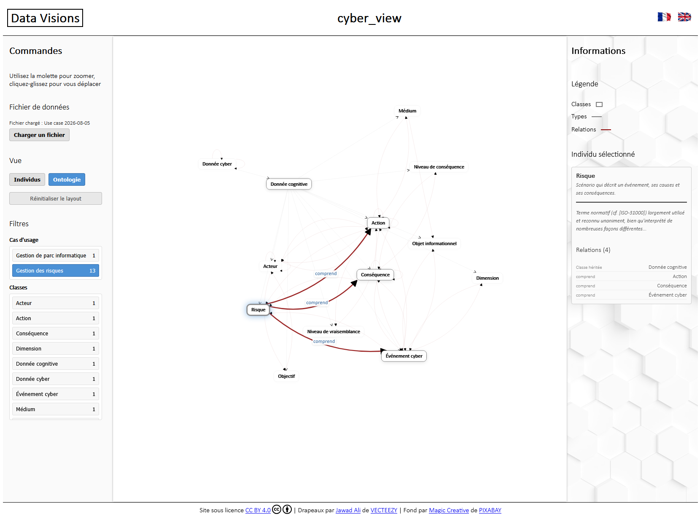

# cyber_view

## Objective

The objective of cyber_view is to **enable the visualization of data used in the cyber scope**.

The general idea would be to simulate a structured data lake, which will expand progressively, with new data from different cyber use cases, and to offer different visualizations of this data.



This should also allow to:
- **demonstrate the value of data visualization**, for example to carry out risk studies (e.g., realizing that objects have already been created and reusing them, identifying inconsistencies and managing them, acting on the various components of risks and not only on vulnerabilities, etc.);
- **highlight the [cyber_ontology](https://github.com/matthieu-grall/cyber_ontology) and the [methodological tools for artificial intelligence (AI)](https://github.com/matthieu-grall/ai)**;
- **carry out numerous study or research projects**.

---

[![CC BY 4.0][cc-by-shield]][cc-by]

This project is licensed under a 
[Creative Commons Attribution 4.0 International License][cc-by].

[![CC BY 4.0][cc-by-image]][cc-by]

[cc-by]: http://creativecommons.org/licenses/by/4.0/
[cc-by-image]: https://i.creativecommons.org/l/by/4.0/88x31.png
[cc-by-shield]: https://img.shields.io/badge/License-CC%20BY%204.0-lightgrey.svg

---

## Features

- **Interactive force-directed graph** — nodes represent cyber objects, edges represent their relationships; automatic layout powered by D3.js
- **Two views** — *Individuals* (use case data: risks, sources, assets, criteria) and *Ontology* (cyber_ontology class hierarchy)
- **Node interaction** — hover for a tooltip, click for a details panel, drag to reposition
- **Filtering** — filter by node type and severity level, combinable
- **Multilingual** — French and English, switchable at any time, persisted in the browser
- **Load your own data** — import any use case JSON file directly in the browser
- **No installation required** — pure static web application

---

## Status and roadmap

### ✅ Current version — 2026-07-23

The application is functional: the graph visualization works for both the Individuals and Ontology views, node details and graph interactions are operational, and the multilingual interface is in place. The latest cleanup pass also aligned the file loader wiring and added lightweight regression checks for the main assets.

### 🔄 Priorities

1. **UI** — keep the HTML/CSS structure lean and documented while refining the visual polish
1. **Data** — consolidate the JSON structure and formalize data management rules
1. **Ontology** — enrich the cyber_ontology (new classes, properties, relations)
1. **Features** — extend node interaction and graph exploration workflows

### ⭕ Later!

1. Data editing;
1. <many instances> Other risk management visualizations;
1. <many instances> Other cyber use cases.
---

## Quick start

```bash
# Option 1: open directly
open index.html

# Option 2: local server (recommended)
python -m http.server 8000
# Then open: http://localhost:8000
```

Requires a modern browser (Chrome 90+, Firefox 88+, Safari 14+, Edge 90+). No build step, no dependencies to install.

---

## Going further

- **[TECHNICAL.md](TECHNICAL.md)** — architecture, file organization, module descriptions, development guide
- **[data/cyber-ontology-rules.md](data/cyber-ontology-rules.md)** — ontology design principles, naming conventions, modeling rules
- **[cyber_ontology](https://github.com/matthieu-grall/cyber_ontology)** — the reference ontology this project builds on
- **[AI methodological tools](https://github.com/matthieu-grall/ai)** — related methodological resources